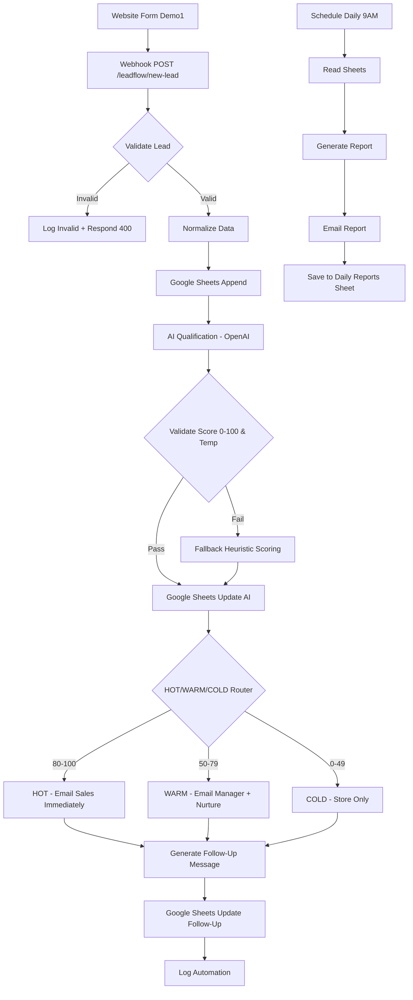

# LeadFlow Automation — DEMO 2 | n8n Lead Automation

**Purpose:** Technical backend demonstration showing how a professional automation agency processes website leads from Demo 1 through a production-style pipeline.

This is **DEMO 2** of the 3-Demo Proof Machine. It connects directly to **DEMO 1 — LeadFlow Pro Website**.

---

## What Was Built

A complete **production-style automation system** with:

1. **Live Backend Server** (`server/index.js`) that implements the full n8n pipeline in Node/Express — runs without needing n8n cloud, perfect for demo.
2. **4 n8n Workflow JSONs** (`workflows/`) that can be imported into n8n Cloud / self-hosted — realistic, maintainable, credential-aware.
3. **Polished Dashboard** (`frontend/`) — React + Tailwind — visualizes live leads, AI qualification, routing, notifications, logs, daily reports.
4. **Google Sheets Templates** (`sheets/`) — CSVs with exact column structure.
5. **Test Payloads** (`tests/`) — HOT, WARM, COLD, INVALID.

### Core Workflow Implemented (Exactly as Specified)

```
Website Form (Demo 1)
↓
Webhook POST /leadflow/new-lead [Node 1]
↓
Validate Lead [Node 2] — required fields, email format, business, need
↓
Normalize Lead Data [Node 3] — capitalize name, lower email, clean phone, generate lead_id, timestamp
↓
Google Sheets Append [Node 4] — 22 columns, credential-based, no hard-coded keys
↓
AI Qualification [Node 5] — LLM prompt returns structured JSON: business_need, lead_intent, urgency, qualification_score, lead_temperature, recommended_action, reasoning, sales_message
↓
Lead Score 0-100 [Transparent Framework]
↓
HOT / WARM / COLD Router [Node 6] — 80-100 HOT, 50-79 WARM, 0-49 COLD
↓
Email Notification [Node 7] — HOT immediate to sales, WARM to manager, COLD suppressed
↓
Follow-Up Generation [Node 8] — personalized message referencing business + need
↓
Follow-Up Delivery [Node 9] — Email LIVE ready, WhatsApp/CRM/Slack placeholder documented
↓
Daily Report [Node 11] — Scheduled, totals, avg score, highest lead, breakdowns
↓
Error Handling [Node 10] — every node wrapped, logs lead_id, error type, timestamp, failed node
```

---

## Architecture — 4 Workflows (Recommended)

Instead of one enormous unmaintainable workflow, we split into logical workflows:

### Workflow A: Lead Intake & Validation
**File:** `Workflow-A-Lead-Intake-Validation.json`
- **Trigger:** Webhook POST `/leadflow/new-lead`
- **Nodes:** Webhook → IF Required Fields → IF Valid Email → Code Full Validation → Code Normalize → Google Sheets Append → Execute Workflow B → Respond Invalid + Log Invalid
- **Error Handling:** Invalid leads marked, recorded, returned with 400, not discarded silently
- **Security:** No secrets, input validation, sanitization

### Workflow B: AI Qualification
**File:** `Workflow-B-AI-Qualification.json`
- **Trigger:** Execute Workflow Trigger (called by A)
- **Nodes:** OpenAI Chat Complete (gpt-4o-mini) with system prompt for structured JSON → Code Validate AI Output (checks score 0-100, temperature correspondence, required fields) → Google Sheets Update → Execute Workflow C
- **Fallback:** Code Fallback Scoring when AI fails (heuristic)
- **Scoring Transparency:** Prompt includes exact scoring criteria (Budget 35pts, Intent 25pts, Urgency 15pts, Quality 25pts = 100)
- **Credentials:** OpenAI API via n8n credential system

### Workflow C: Notification & Follow-Up
**File:** `Workflow-C-Notification-FollowUp.json`
- **Trigger:** Execute Workflow Trigger (called by B)
- **Nodes:** IF HOT? → Email HOT Alert (SMTP) → IF WARM? → Email WARM → Code Handle COLD → Code Generate Follow-Up Package (sales message + channels) → Google Sheets Update Follow-Up → Google Sheets Log Automation
- **Channels:** Email LIVE (SMTP creds), WhatsApp placeholder (requires WhatsApp Business API), CRM placeholder (HubSpot/Salesforce), Slack placeholder — all clearly documented as DEMO vs LIVE
- **Email Example:** Subject "🔥 HOT LEAD — {{business}} — Score {{score}}" with full lead details, AI reasoning, recommended action

### Workflow D: Daily Reporting
**File:** `Workflow-D-Daily-Reporting.json`
- **Trigger:** Schedule Daily 9AM
- **Nodes:** Google Sheets Read Leads → Code Generate Daily Report (totals, valid/invalid, hot/warm/cold, avg score, highest lead, most common need/industry, immediate action list) → Email Send Daily Report → Google Sheets Save Report
- **Report Includes:** Total, valid, invalid, hot/warm/cold, avg score, highest scoring lead, most common business need, most common industry, leads requiring immediate action, follow-ups sent, failed automations
- **Subject:** "LeadFlow Daily Report — {{date}}"

**Mermaid Diagram:**


---

## Live Backend Server (Demo Mode)

**Location:** `server/index.js`
**Port:** 3001
**Run:** `npm run dev` or `node server/index.js`

**Endpoints:**
- `POST /leadflow/new-lead` — Main webhook (Node 1)
- `GET /api/leads` — List leads (simulates Sheets)
- `GET /api/logs` — Automation logs (Node 10)
- `GET /api/reports` — Reports
- `POST /api/daily-report` — Trigger daily report (Node 11)
- `GET /api/daily-report` — Generate report
- `POST /api/test/hot|warm|cold|invalid` — Test payloads
- `GET /api/config` — Show LIVE vs DEMO status
- `GET /` — Health + endpoints

**Storage:** `data/leads.json`, `data/logs.json`, `data/reports.json` — simulates Google Sheets when `GOOGLE_SHEETS_ENABLED=false`. When true, would call real Sheets API (code commented, ready).

**AI:** Heuristic engine that mimics LLM behavior without API keys — transparent scoring. In n8n workflows, OpenAI node uses same prompt.

**Email:** Simulated — logs notification. When `EMAIL_ENABLED=true`, uses nodemailer with SMTP creds.

**WhatsApp/CRM/Slack:** Placeholder nodes with clear documentation — never claims message sent when simulated.

---

## Google Sheets Design

**Spreadsheet:** 4 sheets

### Leads (Master Database) — 22 Columns
Lead ID, Date, Name, Business, Email, Phone, Website, Industry, Budget, Need, Message, Source, AI Business Need, Lead Intent, Urgency, Qualification Score, Lead Temperature, Recommended Action, Sales Message, Notification Status, Follow-Up Status, Created At

**CSV Template:** `sheets/Leads.csv`

### Automation Logs — Workflow Execution History
Timestamp, Lead ID, Node, Event Type, Message, Level, Data
**CSV:** `sheets/Automation-Logs.csv`

### Daily Reports — Historical Summaries
Date, Total Leads, Valid Leads, Invalid Leads, Hot Leads, Warm Leads, Cold Leads, Avg Score, Highest Lead, Most Common Need, Most Common Industry, Generated At
**CSV:** `sheets/Daily-Reports.csv`

### Configuration — Non-sensitive Values
Key, Value, Description, Env Var
**CSV:** `sheets/Configuration.csv`

**Setup Instructions:**
1. Create new Google Sheet
2. Create 4 tabs with exact names: Leads, Automation Logs, Daily Reports, Configuration
3. Copy headers from CSVs
4. In n8n, create Google Sheets OAuth2 credential
5. Set env `GOOGLE_SHEETS_ID` to spreadsheet ID (from URL)
6. Set `GOOGLE_SHEETS_ENABLED=true`

---

## AI Qualification — Structured Output

**Required Output (as specified):**
```json
{
  "business_need": "Lead Generation | Website | Conversion Optimization | CRM Automation | AI Automation | Follow-Up Automation | Other",
  "lead_intent": "Researching | Interested | Evaluating | Ready to Buy",
  "urgency": "Low | Medium | High | Critical",
  "qualification_score": 0,
  "lead_temperature": "HOT | WARM | COLD",
  "recommended_action": "",
  "reasoning": "",
  "sales_message": ""
}
```

**Scoring Framework (Transparent, Not Random):**
- **Budget (35pts):** <$1k=5, $1k-$5k=10-20, $5k-$15k=20-28, $15k-$50k=28-35, $50k+=35
- **Intent (25pts):** Researching=5, Interested=12, Evaluating=18, Ready to Buy=25
- **Urgency (15pts):** Low=2, Medium=6, High=10, Critical=15
- **Data Quality (25pts):** Business email +8, website +5, message >50 chars +7, specific need +5
- **Total:** 0-100
- **Temperature:** 80-100 HOT (strong intent, clear need, realistic budget, urgent), 50-79 WARM (good potential, needs nurturing), 0-49 COLD (low intent, unclear, poor fit)

**Validation:**
- Score numeric, 0-100
- Temperature corresponds to score (auto-corrected if mismatch)

**Prompt Used (in n8n OpenAI node):**
> System: You are LeadFlow Pro's lead qualification AI... [full prompt in Workflow B JSON]
> User: Lead to analyze: Name, Business, Email, Phone, Website, Industry, Budget, Need, Message...

---

## Lead Scoring — Router

**HOT (80-100):** Send immediately to sales notification path — Email with 🔥 subject, Slack alert placeholder, immediate follow-up
**WARM (50-79):** Nurture/follow-up path — Email to manager, case studies, book discovery call within 48h
**COLD (0-49):** Store and include in reporting, avoid aggressive follow-up — newsletter only

---

## Email Notification

**HOT:**
Subject: "🔥 HOT LEAD — {{business}} — Score {{score}}"
To: `SALES_TEAM_EMAIL` env
Body: Name, Business, Email, Phone, Need, Budget, Intent, Urgency, Score, Reasoning, Recommended Action

**WARM:** Lower priority, to `MANAGER_EMAIL`
**COLD:** Suppressed

All recipients from env vars, no hard-coded personal emails.

---

## Follow-Up Generation

**Structure:**
- Greeting with first name
- Acknowledgement of business need
- Specific observation from need/message
- Suggested next step
- CTA for strategy call
- Professional closing
- Never unsupported promises

**Example:** (see server/index.js `sales_message` template)

Stored in Google Sheets column "Sales Message".

**Delivery:**
- Email: LIVE when SMTP creds present, else DEMO simulated
- WhatsApp: Placeholder — requires WhatsApp Business API, documented
- CRM: Placeholder — HubSpot/Salesforce node ready
- Slack: Placeholder

Never claims sent when simulated.

---

## Error Handling — Node 10

**Handles:**
- Invalid webhook payload → 400, log, store as INVALID
- Invalid email → validation error
- Google Sheets failure → log, fallback to local JSON, retry
- AI failure → fallback heuristic scoring, log
- JSON parsing failure → try extract from markdown, else fallback
- Email failure → log, continue workflow
- API timeout → catch, log, fallback
- Missing credentials → check env, log, DEMO mode
- Unexpected AI output → validate required fields, score range, temperature

**Logs:** lead_id, error type, timestamp, failed node, error message — no credentials exposed

**Location:** `data/logs.json` + console + (in n8n) Automation Logs sheet

---

## Daily Report — Node 11

**Schedule:** Daily 9AM (cron) — Workflow D
**Trigger Manually:** POST `/api/daily-report`

**Report Includes:**
- Total leads, valid, invalid, hot, warm, cold
- Average qualification score
- Highest-scoring lead (name, business, score)
- Most common business need
- Most common industry
- Leads requiring immediate action (HOT list)
- Follow-ups sent (count from logs)
- Failed automations (error logs)

**Email:** Subject "LeadFlow Daily Report — {{date}}" to `MANAGER_EMAIL`

**Storage:** Daily Reports sheet + `data/reports.json`

---

## Required Credentials & Env Vars

**File:** `.env` (create from `.env.example`)

```env
# Google Sheets
GOOGLE_SHEETS_ENABLED=false
GOOGLE_SHEETS_ID=1a2b3c4d_demo
GOOGLE_CREDENTIALS_PATH=./credentials.json

# Email (SMTP)
EMAIL_ENABLED=false
SMTP_HOST=smtp.gmail.com
SMTP_PORT=587
SMTP_USER=your_email@gmail.com
SMTP_PASS=your_app_password
EMAIL_FROM=automation@leadflowpro.demo
SALES_TEAM_EMAIL=sales@leadflowpro.demo
MANAGER_EMAIL=manager@leadflowpro.demo

# AI
AI_PROVIDER=heuristic
# AI_PROVIDER=openai
OPENAI_API_KEY=sk-...
AI_MODEL=gpt-4o-mini

# WhatsApp
WHATSAPP_ENABLED=false
WHATSAPP_NUMBER=14155552671

# Server
PORT=3001
```

**Security:**
- Webhook auth: Add header check `X-API-Key` in n8n Webhook node or Express middleware
- No hard-coded secrets
- Env vars only
- Credential management via n8n credentials
- Error logging without exposing creds

---

## Webhook Setup

**n8n Webhook Node:**
- Method: POST
- Path: `/leadflow/new-lead`
- Response Mode: Response Node
- Auth: Optional header auth

**Expected Payload (from Demo 1):**
```json
{
  "name": "Jane Doe",
  "business": "Acme Inc",
  "email": "jane@acme.co",
  "phone": "+14155552671",
  "website": "acme.co",
  "industry": "B2B SaaS",
  "budget": "$5k-$15k",
  "needs": "Conversion Optimization",
  "message": "We need to improve landing page conversion...",
  "source": "LeadFlow Pro Website",
  "timestamp": "2026-09-13T10:00:00Z"
}
```

**Demo 1 Integration:**
- Demo 1 website `CONFIG.leadWebhookUrl` set to `http://localhost:3001/leadflow/new-lead`
- Form POSTs JSON payload
- Or saves to localStorage and dashboard reads

---

## AI Configuration

**Provider Options:**
- `heuristic` — No API key, transparent scoring (used in demo server)
- `openai` — Uses OpenAI API, model `gpt-4o-mini`, prompt in Workflow B
- `anthropic` — Similar, change node type to Anthropic

**n8n Setup:**
1. Create OpenAI credential in n8n (API key)
2. Set env `AI_MODEL=gpt-4o-mini`
3. Import Workflow B
4. Connect credential to OpenAI node

---

## Email Configuration

**n8n SMTP Credential:**
- Host, Port, User, Pass from env
- From: `EMAIL_FROM`

**Demo Mode:** When `EMAIL_ENABLED=false`, logs email instead of sending — clearly marked DEMO.

---

## Testing Instructions

**1. Start Backend:**
```bash
cd /home/user/leadflow-automation
npm install
node server/index.js
# → http://localhost:3001
```

**2. Start Dashboard:**
```bash
cd frontend
npm install
npm run dev
# → http://localhost:5174
```

**3. Test via Dashboard:**
- Click Test HOT / WARM / COLD / INVALID buttons
- See leads appear, AI qualification, routing, logs

**4. Test via Demo 1 Website:**
- Open Demo 1 (http://localhost:5173)
- Submit lead form
- Set `VITE_LEAD_WEBHOOK_URL=http://localhost:3001/leadflow/new-lead` in Demo 1 .env
- Watch lead flow into automation dashboard

**5. Test via curl:**
```bash
curl -X POST http://localhost:3001/leadflow/new-lead \
  -H "Content-Type: application/json" \
  -d @tests/hot-lead.json

curl -X POST http://localhost:3001/api/test/hot
curl -X POST http://localhost:3001/api/daily-report
```

**6. Test Every Path:**
- HOT: High budget + urgent + ready to buy → should score 80+, HOT, immediate email
- WARM: Moderate budget + interested + evaluating → 50-79, WARM, manager email
- COLD: Low budget + vague + gmail → 0-49, COLD, suppressed
- INVALID: Missing email → 400, stored as INVALID, not qualified

---

## Troubleshooting

**Webhook not receiving:**
- Check backend running on 3001
- Check Demo 1 `VITE_LEAD_WEBHOOK_URL` points to correct URL
- Check CORS — backend has cors() enabled
- Check logs in `data/logs.json`

**Google Sheets not updating:**
- Check `GOOGLE_SHEETS_ENABLED` — if false, uses local JSON (expected in demo)
- If true, check `GOOGLE_SHEETS_ID` and OAuth credential
- Check sheet names: Leads, Automation Logs, Daily Reports

**AI failing:**
- If `AI_PROVIDER=heuristic`, no API key needed — always works
- If `openai`, check `OPENAI_API_KEY` env and n8n credential
- Check fallback scoring in logs

**Email not sending:**
- Check `EMAIL_ENABLED` — if false, DEMO mode (expected)
- If true, check SMTP_HOST, PORT, USER, PASS
- Check `SALES_TEAM_EMAIL` and `MANAGER_EMAIL` env

**Score mismatch:**
- Check validation in Code - Validate AI Output — auto-corrects temperature if mismatch
- Check heuristic breakdown in logs

---

## LIVE vs DEMO / PLACEHOLDER

| Component | Status | Notes |
|-----------|--------|-------|
| Webhook | **LIVE** | Fully functional Express + n8n Webhook node |
| Validation | **LIVE** | Full validation, no silent discard |
| Normalization | **LIVE** | Capitalization, formatting, lead_id generation |
| Google Sheets | **DEMO (local JSON) by default, LIVE ready** | Local JSON simulates Sheets; set GOOGLE_SHEETS_ENABLED=true + OAuth for LIVE |
| AI Qualification | **LIVE (heuristic) + LIVE ready (OpenAI)** | Heuristic works without keys; OpenAI node ready with prompt |
| Lead Score | **LIVE** | Transparent framework, 0-100, validated |
| Router | **LIVE** | HOT/WARM/COLD conditional routing |
| Email Notification | **DEMO simulated, LIVE ready** | Logs email; set EMAIL_ENABLED=true + SMTP for LIVE |
| Follow-Up Generation | **LIVE** | Personalized message generated |
| Follow-Up Delivery | **DEMO placeholder for WhatsApp/CRM/Slack, LIVE for Email** | Clearly documented, never claims sent when simulated |
| Error Handling | **LIVE** | Every path handled, logs with lead_id |
| Daily Report | **LIVE** | Generated, emailed (DEMO/LIVE), saved |

Never claims external message sent when only simulated.

---

## Final Standard — Agency-Quality

- **Reliability:** Every node has error handling, fallback, validation
- **Clear Architecture:** 4 workflows, not one monolith, Execute Workflow nodes
- **Maintainability:** Env vars, credentials via n8n, no hard-coded secrets, commented code
- **Data Quality:** Normalization, validation, business email check, website check
- **Transparent Scoring:** Exact criteria in prompt, breakdown logged, temperature correspondence validated
- **Security:** Input validation, sanitization, credential management, minimal PII in logs
- **Professional Documentation:** This README, architecture diagram, setup guides, troubleshooting

---

## How to Demo to Client

1. Open Demo 1 website (LeadFlow Pro) — submit HOT lead
2. Show webhook receiving in backend logs (terminal or dashboard)
3. Open Dashboard (5174) — see lead enter Leads table, AI qualification happen, score 92 HOT
4. Click lead → show detail: AI reasoning, score breakdown, email notification preview, follow-up message
5. Show Automation Logs — validation, normalization, AI, routing, notification
6. Click Test WARM, COLD, INVALID — show different paths
7. Trigger Daily Report — show totals, avg score, highest lead, breakdowns
8. Show n8n workflow JSONs — importable, production-style, credential-aware
9. Show Google Sheets templates — ready for client
10. Explain LIVE vs DEMO — what needs credentials to go LIVE

**The finished n8n system looks like something a professional automation agency could show as evidence of technical capability.**

---

## Running / Viewing

**Backend:** http://localhost:3001
**Dashboard:** http://localhost:5174
**Demo 1 Website:** http://localhost:5173 (should POST to backend)

All three demos connect: Website → Automation → (next) AI Business Automation.

---

**DEMO 2 Completed.** Ready for DEMO 3 — AI Business Automation.
